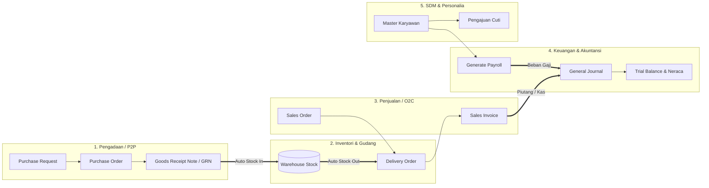

# 🏢 ERP ENTERPRISE SYSTEM (Multi-Module Single DB)

[](https://golang.org)
[](https://nextjs.org)
[](https://postgresql.org)
[](https://typescriptlang.org)
[](https://tailwindcss.com)
[](https://github.com)
[](LICENSE)

---

## 📌 1. Ikhtisar Sistem (System Overview)

**ERP Enterprise System** adalah platform otomasi operasional dan manajemen sumber daya perusahaan skala *Enterprise* yang terintegrasi secara *end-to-end*. Sistem dirancang untuk menghilangkan silo data antar divisi (*Excel-based isolation*) dengan menyatukan seluruh alur bisnis—**Inventori & Gudang, Pengadaan (Procurement/Purchasing), Penjualan & Distribusi (Sales & CRM), Keuangan & Akuntansi (Finance & Double-Entry Bookkeeping), serta Manajemen SDM & Penggajian (HR & Payroll)**—ke dalam satu database terpusat dengan isolasi skema (*Schema Separation*) berstandar ACID.

---

## 🏗️ 2. Arsitektur & Teknologi (Tech Stack)

```
┌────────────────────────────────────────────────────────────────────────┐
│                   FRONTEND LAYER (Next.js 14 App Router)               │
│      React 18 • TypeScript • Tailwind CSS • Glassmorphism • Native PDF │
└──────────────────────────────────┬─────────────────────────────────────┘
                                   │ HTTPS / RESTful API (JSON)
                                   ▼
┌────────────────────────────────────────────────────────────────────────┐
│                   BACKEND LAYER (Golang 1.22 + Gin Gonic)              │
│    Clean Architecture / DDD • GORM • JWT Token Rotation • RBAC Shield  │
├─────────────┬─────────────┬─────────────┬─────────────┬────────────────┤
│  Auth Mod   │  Inventory  │ Purchasing  │    Sales    │ Finance & HR   │
└─────────────┴──────┬──────┴──────┬──────┴──────┬──────┴────────┬───────┘
                     │             │             │               │
                     ▼             ▼             ▼               ▼
┌────────────────────────────────────────────────────────────────────────┐
│            DATABASE LAYER (PostgreSQL 16 Multi-Schema Isolation)       │
│  Schema: auth | inventory | purchasing | sales | finance | hr | audit  │
└────────────────────────────────────────────────────────────────────────┘
```

### 💻 Stack Teknologi Utama:
* **Backend Engine**: **Golang (Go 1.22+)** dengan framework **Gin Gonic** bertenaga tinggi, terstruktur menggunakan *Domain-Driven Design (DDD)* & *Clean Architecture*.
* **Database & ORM**: **PostgreSQL 16** dengan **GORM**—menggunakan *Schema Isolation* (`auth`, `inventory`, `purchasing`, `sales`, `finance`, `hr`) dan transaksi atomik ACID (`BEGIN ... COMMIT / ROLLBACK`).
* **Frontend Web App**: **Next.js 14 (App Router)**, **React 18**, **TypeScript**, dan **Tailwind CSS** dengan desain modern *Glassmorphism & Dynamic Animations*.
* **Keamanan & Otorisasi**: **JWT (JSON Web Tokens)** dengan sistem *Access Token + Refresh Token Rotation*, enkripsi kata sandi **Bcrypt**, dan proteksi wewenang **RBAC (*Role-Based Access Control*)**.
* **Engine Cetak & Dokumen**: **Client-Side Native PDF Engine (`lib/pdf-export.ts`)** yang mampu mencetak dokumen resmi A4 ber-kop surat dan tanda tangan dalam hitungan milidetik tanpa *dependency* eksternal yang lambat.
* **Infrastruktur**: **Docker & Docker Compose** untuk orkestrasi container database dan backend.

---

## 🔄 3. Alur Proses Bisnis Terintegrasi (Business Workflows)



### 📦 A. Siklus Inventori & Pergudangan (*Inventory & Warehouse*)
1. **Katalog Produk & Varian**: Manajemen SKU produk, harga beli pokok (HPP), harga jual, kategori barang, dan satuan unit (UoM: PCS, BOX, KG, LTR, MTR).
2. **Manajemen Multi-Gudang**: Pemetaan stok per unit gudang (Gudang Utama Jakarta, Gudang Distribusi Surabaya, dll.).
3. **Buku Mutasi Stok Atomik**: Setiap pergerakan barang (`IN`, `OUT`, `TRANSFER` antar-gudang, dan `ADJUSTMENT` Opname Fisik) dieksekusi dalam transaksi ACID database untuk mencegah selisih stok.
4. **Deteksi Stok Kritis**: Peringatan otomatis ketika stok fisik menyentuh batas minimum (*Minimum Stock Alert*).

### 📑 B. Siklus Pengadaan (*Procure-to-Pay / P2P*)
1. **Purchase Request (PR)**: Pengajuan kebutuhan material/barang dari divisi operasional.
2. **Alur Otorisasi & Persetujuan (Approval)**: Verifikasi nominal oleh Manager/Approver.
3. **Purchase Order (PO)**: Penerbitan surat pesanan resmi kepada vendor, kalkulasi pajak PPN 11%, estimasi tanggal kirim, dan cetak dokumen PO resmi ber-kop surat.
4. **Penerimaan Barang Fisik (GRN)**: Petugas gudang memverifikasi barang masuk $\rightarrow$ Sistem **secara otomatis menambahkan saldo stok fisik di gudang terkait** dan mencatat log mutasi masuk (`IN`).

### 🛍️ C. Siklus Penjualan & Distribusi (*Order-to-Cash / O2C*)
1. **Master Pelanggan**: Direktori data rekanan pembeli B2B dan pelanggan retail.
2. **Sales Order (SO)**: Penerimaan pesanan penjualan, penentuan gudang asal, kalkulasi subtotal, diskon, dan PPN.
3. **Surat Jalan / Delivery Order (DO)**: Pengiriman logistik barang $\rightarrow$ Sistem **secara otomatis memotong saldo stok gudang** (`OUT`) dan memvalidasi ketersediaan kuantitas secara *real-time*.
4. **Faktur Penjualan (Sales Invoice)**: Penerbitan tagihan resmi ke pelanggan $\rightarrow$ Terintegrasi dengan saldo piutang dagang dan pencatatan pembayaran kas.

### 📊 D. Siklus Keuangan & Akuntansi (*Record-to-Report / R2R*)
1. **Bagan Akun Standar (Chart of Accounts / COA)**: Struktur buku besar akuntansi 5 klasifikasi (`ASSET`, `LIABILITY`, `EQUITY`, `REVENUE`, `EXPENSE`).
2. **Buku Jurnal Umum (*Double-Entry Bookkeeping*)**: Transaksi debit dan kredit dengan validasi matematis seimbang ($\sum \text{Debit} = \sum \text{Credit}$).
3. **Laporan Neraca Saldo (*Trial Balance*)**: Kalkulasi *real-time* saldo mutasi kas, piutang usaha, nilai valuasi persediaan barang dagang, modal disetor, dan kalkulasi laba bersih berjalan.

### 🧑‍💼 E. Siklus Sumber Daya Manusia (*Hire-to-Retire / HR & Payroll*)
1. **Direktori Karyawan**: Data personil lengkap (NIK, Nama, Kontak, Departemen, Jabatan, Tanggal Masuk, dan Gaji Pokok).
2. **Pengajuan & Izin Cuti**: Alur pengajuan cuti tahunan, izin sakit (surat dokter), cuti melahirkan, serta persetujuan atasan (*Approval workflow*).
3. **Kalkulasi Payroll Otomatis**: Generator batch penggajian bulanan dengan perhitungan otomatis:
   $$\text{Gaji Bersih (THP)} = \text{Gaji Pokok} + \text{Tunjangan (10\%)} - \text{Potongan Pajak/BPJS (5\%)}$$
4. **Cetak Slip Gaji Resmi (*Official Payslip*)**: Dokumen slip gaji individual siap unduh/cetak dengan otorisasi divisi HR/Keuangan.

### 🔐 F. Keamanan & Matriks Hak Akses (*Role-Based Access Control / RBAC*)
1. **Manajemen Pengguna (Users)**: Pendaftaran personil baru, penugasan multi-peran, dan *toggle* status aktif/nonaktif.
2. **Matriks Peran (Role & Permission Matrix)**: Pengaturan izin granular per modul (`inventory:*`, `purchasing:*`, `sales:*`, `finance:*`, `hr:*`, `auth:*`).
3. **Kustomisasi Role**: Kemampuan membuat peran kustom baru (misal: *Supervisor Gudang*, *Auditor Finance*, *Kasir Penjualan*) dengan *batch permission toggle*.

---

## 🖨️ 4. Fitur Export & Cetak PDF Resmi di Seluruh Modul

Sistem dilengkapi generator PDF bawaan berkecepatan tinggi yang menghasilkan dokumen resmi standar korporat (Ukuran A4 Portrait & Landscape, Kop Surat Perusahaan, format mata uang Rupiah `Rp`, dan kolom tanda tangan otorisasi):

| Modul ERP | Dokumen Laporan Rekapitulasi (PDF) | Dokumen Transaksi Resmi (PDF Print) |
|---|---|---|
| **Inventori** | Laporan Katalog Produk & Valuasi Aset, Mutasi Stok, Master Gudang | Bukti Berita Acara Opname Fisik |
| **Purchasing** | Rekap Purchase Request, Rekap PO, Rekap Penerimaan Barang (GRN) | **Surat Pesanan Pembelian (PO Form)** + Tanda Tangan 3 Pihak |
| **Sales** | Rekap Master Pelanggan, Rekap Sales Order, Rekap Piutang Invoice | **Surat Konfirmasi Pesanan (SO)**, **Surat Jalan (DO)**, **Faktur Tagihan (Invoice)** |
| **Finance** | Laporan Neraca Saldo (*Trial Balance*), Buku Jurnal Umum, Bagan Akun COA | Voucher Transaksi Jurnal Memorial |
| **HR / SDM** | Direktori Pegawai & Beban Gaji Pokok, Rekap Pengajuan Cuti | **Slip Gaji Karyawan Resmi (*Official Payslip*)** |
| **Keamanan** | Laporan Direktori Akun Pengguna, **Matriks Hak Akses Peran (RBAC Matrix)** | Lembar Otorisasi Peran Sistem |

---

## 🗄️ 5. Skema Database PostgreSQL (`erp_db`)

Database dirancang dengan isolasi skema per modul (*Schema Separation*) di dalam database `erp_db`:

```sql
erp_db
├── auth/          -- users, roles, permissions, user_roles, role_permissions, refresh_tokens
├── inventory/     -- categories, units, products, warehouses, warehouse_stocks, stock_mutations
├── purchasing/    -- suppliers, purchase_requests, purchase_request_items, purchase_orders, purchase_order_items, goods_receipts
├── sales/         -- customers, sales_orders, sales_order_items, delivery_orders, sales_invoices
├── finance/       -- accounts, journal_entries, journal_lines
├── hr/            -- departments, positions, employees, leave_requests, payroll
└── audit/         -- audit_logs
```

---

## 🚀 6. Panduan Menjalankan Sistem (Getting Started)

### Prasyarat:
* **Node.js** (v18.x atau lebih baru)
* **Golang** (v1.22 atau lebih baru)
* **PostgreSQL 16** (atau via **Docker**)

### Langkah 1: Kloning Repositori
```bash
git clone https://github.com/username/erp-enterprise.git
cd erp-enterprise
```

### Langkah 2: Menjalankan Database PostgreSQL
Gunakan Docker Compose untuk menyalakan database PostgreSQL beserta seluruh migrasi skema dan seeder awal secara otomatis:
```bash
docker-compose up -d postgres
```
*(Atau pastikan PostgreSQL lokal aktif pada port `5432` dengan database `erp_db`).*

---

### Langkah 3: Menjalankan Backend API (Golang)
1. Buka direktori backend:
   ```bash
   cd backend
   ```
2. Jalankan server backend:
   ```bash
   # Jalankan via Go CLI
   go run ./cmd/api
   
   # ATAU jalankan binary yang sudah terkompilasi (Windows)
   .\erp-api-new.exe
   ```
   *Backend API akan berjalan di: `http://localhost:8080`.*

---

### Langkah 4: Menjalankan Frontend Web App (Next.js)
1. Buka direktori frontend pada terminal baru:
   ```bash
   cd frontend
   ```
2. Pasang dependensi dan jalankan server development:
   ```bash
   npm install
   npm run dev
   ```
   *Aplikasi Web siap diakses di: `http://localhost:3000`.*

---

## 🔑 7. Kredensial Akun Login Default

Gunakan kredensial berikut pada halaman login **[`http://localhost:3000/login`](http://localhost:3000/login)**:

| Peran Akun | Email Login | Password Default | Hak Akses |
|---|---|---|---|
| **Super Administrator** | `admin@erp.local` | `admin123` | **Akses Penuh (Full Control)** ke seluruh 6 modul ERP & Manajemen Pengguna |
| **Admin Inventori** | *(Dapat dibuat di `/auth-management/users`)* | Sesuai input | Akses Modul Katalog Produk, Stok, Gudang, & Mutasi |
| **Staff Purchasing** | *(Dapat dibuat di `/auth-management/users`)* | Sesuai input | Akses Vendor, Purchase Request, PO, & Penerimaan GRN |
| **Staff Penjualan** | *(Dapat dibuat di `/auth-management/users`)* | Sesuai input | Akses Pelanggan, Sales Order, Surat Jalan DO, & Faktur |
| **Staff Keuangan** | *(Dapat dibuat di `/auth-management/users`)* | Sesuai input | Akses Bagan Akun COA, Jurnal Umum, & Neraca Saldo |
| **Staff HR / SDM** | *(Dapat dibuat di `/auth-management/users`)* | Sesuai input | Akses Master Pegawai, Persetujuan Cuti, & Payroll |

---

## 📡 8. Ringkasan Endpoint API Backend (`/api/v1`)

### 🔐 Modul Auth & RBAC
* `POST /api/v1/auth/login` — Autentikasi kredensial & penerbitan token JWT
* `POST /api/v1/auth/refresh-token` — Rotasi token akses
* `POST /api/v1/auth/logout` — Pencabutan sesi token
* `GET  /api/v1/auth/profile` — Profil akun login aktif
* `GET  /api/v1/auth/users` — Daftar pengguna terdaftar
* `POST /api/v1/auth/users` — Pendaftaran akun pengguna baru
* `PUT  /api/v1/auth/users/:id` — Update identitas & peran pengguna
* `DELETE /api/v1/auth/users/:id` — Menonaktifkan akses akun pengguna
* `GET  /api/v1/auth/roles` — Daftar peran sistem beserta izin granular
* `POST /api/v1/auth/roles` — Pembuatan peran (role) kustom baru
* `PUT  /api/v1/auth/roles/:id` — Update peran & deskripsi
* `DELETE /api/v1/auth/roles/:id` — Hapus peran kustom
* `GET  /api/v1/auth/permissions` — Master seluruh izin modular (permissions)
* `PUT  /api/v1/auth/roles/:id/permissions` — Alokasi matriks izin peran

### 📦 Modul Inventori
* `GET    /api/v1/inventory/products` — Katalog produk & stok gudang
* `POST   /api/v1/inventory/products` — Tambah produk baru
* `PUT    /api/v1/inventory/products/:id` — Edit produk & HPP
* `DELETE /api/v1/inventory/products/:id` — Hapus produk
* `GET    /api/v1/inventory/categories` — Master kategori barang
* `GET    /api/v1/inventory/units` — Master satuan unit (UoM)
* `GET    /api/v1/inventory/warehouses` — Master unit gudang
* `GET    /api/v1/inventory/mutations` — Histori mutasi & opname stok
* `POST   /api/v1/inventory/mutations` — Eksekusi mutasi/transfer stok

### 📑 Modul Purchasing
* `GET  /api/v1/purchasing/suppliers` — Master rekanan vendor
* `POST /api/v1/purchasing/suppliers` — Tambah vendor baru
* `GET  /api/v1/purchasing/purchase-requests` — Daftar Purchase Request (PR)
* `POST /api/v1/purchasing/purchase-requests` — Buat pengajuan PR
* `PUT  /api/v1/purchasing/purchase-requests/:id/approve` — Persetujuan PR
* `GET  /api/v1/purchasing/purchase-orders` — Daftar Purchase Order (PO)
* `POST /api/v1/purchasing/purchase-orders` — Penerbitan PO baru
* `PUT  /api/v1/purchasing/purchase-orders/:id/approve` — Otorisasi PO
* `GET  /api/v1/purchasing/goods-receipts` — Histori Penerimaan Barang (GRN)
* `POST /api/v1/purchasing/goods-receipts` — Input penerimaan barang (*Auto Stock IN*)

### 🛍️ Modul Sales & Penjualan
* `GET  /api/v1/sales/customers` — Master pelanggan
* `POST /api/v1/sales/customers` — Tambah pelanggan baru
* `GET  /api/v1/sales/orders` — Daftar Sales Order (SO)
* `POST /api/v1/sales/orders` — Buat Sales Order baru
* `GET  /api/v1/sales/deliveries` — Daftar Surat Jalan (DO)
* `POST /api/v1/sales/deliveries` — Terbitkan Surat Jalan (*Auto Stock OUT*)
* `GET  /api/v1/sales/invoices` — Daftar Faktur Tagihan Penjualan
* `POST /api/v1/sales/invoices/:id/pay` — Pelunasan pembayaran tagihan

### 📊 Modul Finance & Akuntansi
* `GET  /api/v1/finance/accounts` — Bagan Akun Standar (COA)
* `POST /api/v1/finance/accounts` — Tambah rekening COA baru
* `GET  /api/v1/finance/journals` — Buku Jurnal Umum (*Double-Entry*)
* `POST /api/v1/finance/journals` — Input entri jurnal berimbang
* `GET  /api/v1/finance/reports/trial-balance` — Laporan Neraca Saldo (*Real-Time*)

### 🧑‍💼 Modul Human Resources & Payroll
* `GET  /api/v1/hr/employees` — Direktori pegawai
* `POST /api/v1/hr/employees` — Tambah data pegawai baru
* `PUT  /api/v1/hr/employees/:id` — Update biodata & struktur gaji pegawai
* `GET  /api/v1/hr/leaves` — Rekapitulasi permohonan cuti
* `POST /api/v1/hr/leaves` — Pengajuan cuti baru
* `PUT  /api/v1/hr/leaves/:id/status` — Persetujuan/Penolakan cuti
* `GET  /api/v1/hr/payroll` — Rekapitulasi slip gaji payroll
* `POST /api/v1/hr/payroll/generate` — Batch generator payroll bulanan

---

## 📁 9. Struktur Direktori Proyek

```
c:\erp
├── backend/
│   ├── cmd/api/main.go          # Entrypoint server & auto-sync database queries
│   ├── internal/                # Domain module logic (Clean Architecture)
│   │   ├── auth/                # Entity, repository, service, handler Auth & RBAC
│   │   ├── inventory/           # Domain Inventori & Pergudangan
│   │   ├── purchasing/          # Domain Pembelian & Penerimaan Barang GRN
│   │   ├── sales/               # Domain Penjualan, Surat Jalan DO, & Faktur
│   │   ├── finance/             # Domain COA, Jurnal Umum, & Neraca Saldo
│   │   └── hr/                  # Domain Pegawai, Cuti, & Payroll
│   ├── pkg/                     # Reusable utilities (database, JWT, response, logger)
│   ├── Dockerfile
│   └── go.mod
├── frontend/
│   ├── app/
│   │   ├── (auth)/login/        # Halaman Login Full-Width Diagonal Modern
│   │   ├── (dashboard)/         # Protected layout with RBAC Sidebar
│   │   │   ├── dashboard/       # Dashboard metrik analitik lintas modul
│   │   │   ├── inventory/       # Katalog produk, mutasi, kategori, gudang
│   │   │   ├── purchasing/      # Supplier, PR, PO, & GRN
│   │   │   ├── sales/           # Pelanggan, SO, Surat Jalan DO, & Invoices
│   │   │   ├── finance/         # Bagan akun COA, Jurnal Umum, & Laporan Keuangan
│   │   │   ├── hr/              # Data Karyawan, Pengajuan Cuti, & Slip Gaji
│   │   │   └── auth-management/ # Manajemen User & Matriks Hak Akses Role (RBAC)
│   │   ├── globals.css
│   │   └── layout.tsx
│   ├── components/ui/           # Reusable UI component library (Button, Card, Input, SlideOver, Pagination)
│   ├── lib/
│   │   ├── api-client.ts        # Axios API client interceptor
│   │   ├── auth-store.tsx       # Auth context, session restore, & permission validator
│   │   ├── pdf-export.ts        # Native enterprise PDF & printable document generator
│   │   └── utils.ts
│   └── public/assets/           # High-resolution 3D enterprise visual assets
├── database/
│   ├── migrations/              # SQL schema migration files
│   └── seeder/                  # SQL seed data files
├── docker-compose.yml           # Multi-container orchestration
└── README.md                    # Dokumentasi lengkap sistem
```

---

## 📄 10. Lisensi

Hak Cipta &copy; 2026 **ERP Enterprise System**. Dilisensikan di bawah lisensi [MIT](LICENSE).
Semua hak dilindungi undang-undang.
